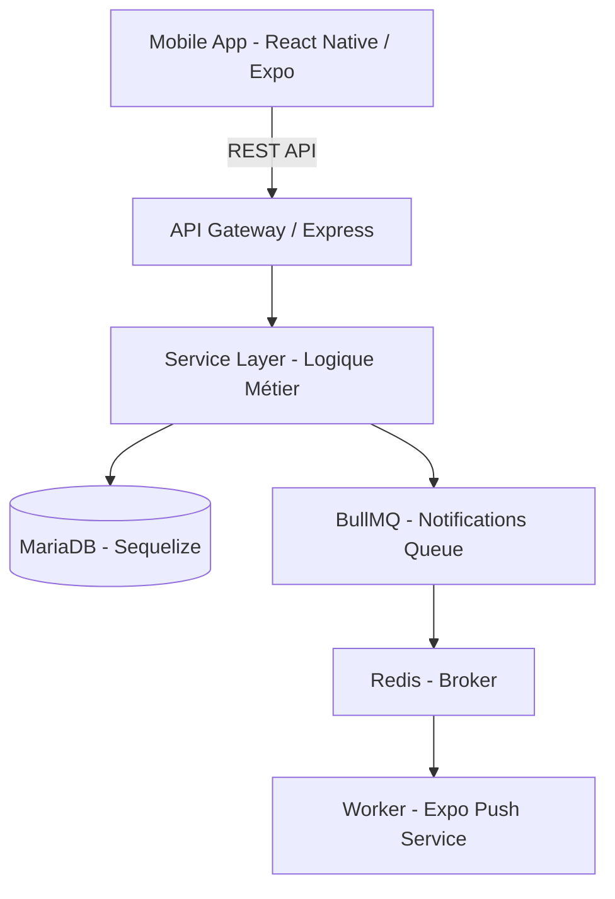

# 🏛️ Architecture VitaSang

## 1. Vue d'ensemble du Système
VitaSang repose sur une architecture découplée orientée services, optimisée pour la réactivité des alertes de don de sang.

## 2. Architecture des Dossiers

### Backend
- `controllers/` : Gestion des requêtes HTTP, extraction des paramètres, réponses.
- `services/` : (À renforcer) Logique métier pure, calculs, interactions complexes, transactions.
- `models/` : Définition des schémas Sequelize et associations.
- `jobs/` : Tâches asynchrones et files d'attente (BullMQ).
- `middleware/` : Authentification (JWT), validation (Joi), rate limiting (Redis), gestion d'erreurs.
- `migrations/` : Évolutions du schéma de base de données.

### Frontend (Mobile)
- `app/` : Navigation basée sur les fichiers (Expo Router).
- `services/` : Appels API (Axios) et gestion du Server State (React Query).
- `components/` : Composants UI réutilisables, organisés par domaine ou atomes/molécules.
- `hooks/` : Logique de composants réutilisable et hooks personnalisés React Query.
- `context/` : État global de l'application (Auth, Paramètres, Thème).
- `constants/` : Thème, dimensions, URLs, chaînes de caractères statiques.

## 3. ADR (Architecture Decision Records)

### ADR 001 : Choix de React Native (Expo SDK 54)
- **Statut :** Accepté
- **Contexte :** Nécessité d'alertes push critiques, de géolocalisation précise et d'une UX fluide sur Android et iOS.
- **Décision :** Utilisation d'Expo pour la rapidité de développement, les OTA updates et l'accès simplifié aux API natives.
- **Conséquence :** Maintenance d'un seul code source pour deux plateformes, build via EAS.

### ADR 002 : TanStack Query (React Query) pour le Server State
- **Statut :** Accepté
- **Contexte :** Synchronisation complexe des stocks de sang et des alertes d'urgence.
- **Décision :** Utiliser React Query pour la mise en cache, la déduplication des requêtes et la gestion automatique du chargement/erreurs.
- **Conséquence :** Code frontend plus propre, moins de `useEffect` et meilleure réactivité.

### ADR 003 : Séparation Contrôleurs / Services (Backend)
- **Statut :** En cours
- **Contexte :** Les contrôleurs deviennent trop complexes et difficiles à tester unitairement.
- **Décision :** Déplacer toute la logique métier complexe dans une couche `services/`.
- **Conséquence :** Meilleure testabilité, réutilisation du code et clarté architecturale.

### ADR 004 : Validation Joi & TypeScript
- **Statut :** Obligatoire
- **Contexte :** Garantir l'intégrité des données de santé et la stabilité du système.
- **Décision :** Utilisation de Joi pour la validation des schémas d'entrée et de TypeScript pour la sécurité de typage.
- **Conséquence :** Élimination d'une classe entière de bugs liés aux données malformées.

## 4. Risques Techniques & Mitigations
1. **Saturation de l'API :** Risque lors d'une alerte massive. *Mitigation : Redis Rate Limiting et file d'attente BullMQ.*
2. **Précision GPS vs Batterie :** *Mitigation : Utilisation de `expo-location` avec des réglages de précision adaptatifs.*
3. **Sécurité des données :** *Mitigation : Chiffrement TLS, JWT avec expiration courte, et validation stricte des rôles (Personnel, Donneur, Admin).*
4. **Disponibilité :** *Mitigation : Monitoring Sentry (Frontend/Backend) et tests d'intégration automatiques.*
