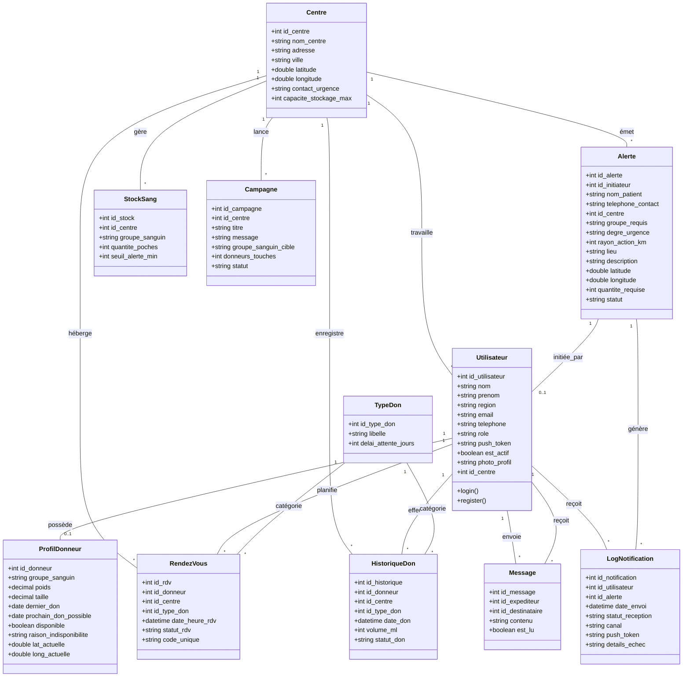

# Diagramme de Classe - VitaSang

Le diagramme suivant représente la structure des données du backend VitaSang (Sequelize). Ce format Mermaid est compatible avec l'importation directe dans des outils comme **StarUML**, **Draw.io**, ou via l'extension **Mermaid** de VS Code.

### Note pour StarUML
Pour importer ce diagramme :
1. Installez l'extension **Mermaid** dans StarUML (si disponible).
2. Sinon, vous pouvez utiliser ce code dans l'éditeur en ligne de Mermaid pour exporter une image SVG/PNG et l'intégrer à votre documentation.
